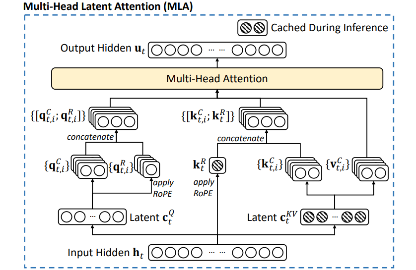

# Multi-Head Latent Attention (MLA)

**Reference:** [*DeepSeek-V2: A Strong, Economical, and Efficient Mixture-of-Experts Language Model*](https://arxiv.org/pdf/2405.04434)

---

## Architecture Overview



Multi-Head Latent Attention compresses the KV cache into a low-rank **latent representation**, dramatically reducing memory during inference while maintaining expressive multi-head attention.

| Component | Description |
|---|---|
| **KV Compression** | Project hidden states to a small latent $c^{KV} \in \mathbb{R}^{d_c}$, then decompress to per-head K & V |
| **Query Compression** | Compress queries to $c^Q \in \mathbb{R}^{d_c'}$ before decompressing per-head |
| **Decoupled RoPE** | Apply RoPE on a separate low-dimensional projection ($d_r$ dims/head), keeping content K/V position-free |
| **KV Cache** | Only cache $c^{KV}$ and $k^R$ — orders of magnitude smaller than full KV |
| **Absorption** | Fuse decompression matrices into Q/O projections at inference — the latent is never decompressed |

---

## Mathematical Formulation

**(7) — KV Compression & Keys:**

$$c_t^{KV} = W^{DKV} x_t, \qquad [k_{t,1}^C;\, k_{t,2}^C;\, \ldots;\, k_{t,n_h}^C] = k_t^C = W^{UK} c_t^{KV}$$

$$k_t^R = \text{RoPE}(W^{KR} x_t,\, t), \qquad k_{t,i} = [k_{t,i}^C;\, k_t^R]$$

**(8) — Query Compression & Queries:**

$$c_t^Q = W^{DQ} x_t, \qquad [q_{t,1}^C;\, q_{t,2}^C;\, \ldots;\, q_{t,n_h}^C] = q_t^C = W^{UQ} c_t^Q$$

$$[q_{t,1}^R;\, q_{t,2}^R;\, \ldots;\, q_{t,n_h}^R] = q_t^R = \text{RoPE}(W^{QR} c_t^Q,\, t), \qquad q_{t,i} = [q_{t,i}^C;\, q_{t,i}^R]$$

**(9) — Attention Output (Training):**

$$[v_{t,1}^C;\, \ldots;\, v_{t,n_h}^C] = v_t^C = W^{UV} c_t^{KV}$$

$$o_{t,i} = \sum_{j=1}^{t} \text{softmax}_j\!\left(\frac{q_{t,i}^{\top} k_{j,i}}{\sqrt{d_h + d_r}}\right) v_{j,i}^C, \qquad y_t = W^O [o_{t,1};\, \ldots;\, o_{t,n_h}]$$

**(10) — Attention Output (Inference / Absorbed):**

$$\hat{q}_{t,i} = [W_i^{UK\top} q_{t,i}^C;\, q_{t,i}^R], \qquad \hat{k}_j = [c_j^{KV};\, k_j^R]$$

$$\hat{o}_{t,i} = \sum_{j=1}^{t} \text{softmax}_j\!\left(\frac{\hat{q}_{t,i}^{\top} \hat{k}_j}{\sqrt{d_h + d_r}}\right) c_j^{KV}, \qquad y_t = W^O [W_1^{UV} \hat{o}_{t,1};\, \ldots;\, W_{n_h}^{UV} \hat{o}_{t,n_h}]$$

---

## 1. Rotary Position Embedding (RoPE)

### Formula

RoPE encodes position information by rotating query and key vectors. For $x \in \mathbb{R}^d$ at position $t$:

$$\text{RoPE}(x, t)_i = \begin{cases} x_i \cos(t\theta_j) - x_{i+d/2} \sin(t\theta_j) & \text{if } i < d/2 \\ x_i \cos(t\theta_j) + x_{i-d/2} \sin(t\theta_j) & \text{if } i \geq d/2 \end{cases}$$

where $\theta_j = 10000^{-2j/d}$.

In MLA, RoPE is **decoupled**: it operates on a separate low-dimensional projection ($d_r$ dims per head), so the content-based K/V remains position-free inside the latent — enabling the absorption trick.

### Implementation

```python
# Precompute cos/sin tables
inv_freq = 1.0 / (base ** (torch.arange(0, dim, 2).float() / dim))  # [dim/2]
t = torch.arange(seq_len, device=device, dtype=inv_freq.dtype)
freqs = torch.outer(t, inv_freq)               # [seq_len, dim/2]
cos, sin = torch.cat([freqs, freqs], dim=-1).cos(), torch.cat([freqs, freqs], dim=-1).sin()

# Apply rotation
def apply_rotary_emb(x, cos, sin):
    x1, x2 = x[..., : x.shape[-1] // 2], x[..., x.shape[-1] // 2 :]
    return x * cos + torch.cat([-x2, x1], dim=-1) * sin
```

---

## 2. Compressed KV Cache

### Formula

Only $c^{KV}$ and $k^R$ are stored. Per-token cache size comparison (fp16):

| | Standard MHA | MLA |
|---|---|---|
| **Cached tensors** | $K \in \mathbb{R}^{T \times n_h d_h}$, $V \in \mathbb{R}^{T \times n_h d_h}$ | $c^{KV} \in \mathbb{R}^{T \times d_c}$, $k^R \in \mathbb{R}^{T \times d_r}$ |
| **Bytes per token** (fp16) | $4 \times n_h \times d_h$ | $2(d_c + d_r)$ |
| **Example** ($n_h{=}8,\, d_h{=}64,\, d_c{=}128,\, d_r{=}32$) | 4 096 B | 320 B (**6.4× smaller**) |

### Implementation

```python
# Cache stores only the latent and RoPE keys — never full K/V
self.c_kv   = None  # [B, T, d_c]   — compressed KV latent
self.k_rope = None  # [B, T, d_r]   — RoPE keys (shared across heads)

def update(self, new_c_kv, new_k_rope):
    if self.c_kv is None:
        self.c_kv, self.k_rope = new_c_kv, new_k_rope
    else:
        self.c_kv   = torch.cat([self.c_kv,   new_c_kv],   dim=1)
        self.k_rope = torch.cat([self.k_rope, new_k_rope], dim=1)
```

---

## 3. Multi-Head Latent Attention

### Core Formulas

For input $h_t \in \mathbb{R}^d$ at step $t$:

**KV compression & decompression:**

$$c_t^{KV} = W^{DKV} h_t, \quad k_t^C = W^{UK} c_t^{KV}, \quad v_t = W^{UV} c_t^{KV}$$

**Query compression & decompression:**

$$c_t^Q = W^{DQ} h_t, \quad q_t^C = W^{UQ} c_t^Q$$

**Decoupled RoPE keys & queries:**

$$q_t^R = \text{RoPE}(W^{QR} c_t^Q,\, t), \quad k_t^R = \text{RoPE}(W^{KR} h_t,\, t)$$

**Full queries & keys (content + RoPE):**

$$q_t = [q_t^C;\; q_t^R], \quad k_t = [k_t^C;\; k_t^R]$$

**Attention:**

$$o_{t,i} = \sum_{j=1}^{t} \text{softmax}_j\!\left(\frac{q_{t,i}^{\top}\, k_j}{\sqrt{d_h + d_r}}\right) v_j, \quad y_t = W^O [o_{t,1};\, \ldots;\, o_{t,n_h}]$$

### Projection Matrix Summary

```
Compression                    Decompression
─────────────                  ──────────────
W_dkv : d  → d_c  (KV down)   W_uk : d_c  → n_h·d_h  (key up)
W_dq  : d  → d_c' (Q down)    W_uv : d_c  → n_h·d_h  (val up)
                               W_uq : d_c' → n_h·d_h  (query up)

RoPE projections               Output
────────────────               ──────
W_qr  : d_c' → n_h·d_r        W_o  : n_h·d_h → d
W_kr  : d    → d_r  (shared)
```

### Implementation

```python
# KV compression / decompression
self.W_dkv = nn.Linear(d_model,   d_kv_comp,        bias=False)  # d  → d_c
self.W_uk  = nn.Linear(d_kv_comp, n_heads * d_head, bias=False)  # d_c → n_h·d_h
self.W_uv  = nn.Linear(d_kv_comp, n_heads * d_head, bias=False)

# Query compression / decompression
self.W_dq  = nn.Linear(d_model,  d_q_comp,          bias=False)  # d  → d_c'
self.W_uq  = nn.Linear(d_q_comp, n_heads * d_head,  bias=False)  # d_c' → n_h·d_h

# Decoupled RoPE projections
self.W_qr  = nn.Linear(d_q_comp, n_heads * d_rope,  bias=False)  # per-head RoPE Q
self.W_kr  = nn.Linear(d_model,  d_rope,             bias=False)  # shared RoPE K

# Output
self.W_o   = nn.Linear(n_heads * d_head, d_model,   bias=False)
self.scale = math.sqrt(d_head + d_rope)
```

---

## 4. Weight Absorption (Inference Trick)

### Formula

To avoid decompressing $c^{KV}$ at inference, the decompression matrices are **fused** into query and output projections.

**Score absorption (QK)** — pre-compute per head $h$:

$$q_h^C \cdot (k_h^C)^\top = c^Q \cdot \underbrace{W_{uq,h}^\top\, W_{uk,h}}_{W_{qk,h}} \cdot (c^{KV})^\top$$

$$W_{qk,h} \in \mathbb{R}^{d_c' \times d_c} \quad \text{(computed once)}$$

**Value-output absorption (VO)** — pre-compute per head $h$:

$$o_h \cdot W_{o,h}^\top = \text{attn}_h \cdot c^{KV} \cdot \underbrace{W_{uv,h}^\top\, W_{o,h}^\top}_{W_{vo,h}}$$

$$W_{vo,h} \in \mathbb{R}^{d_c \times d} \quad \text{(computed once)}$$

$$\text{output} = \sum_{h=1}^{n_h} \text{attn}_h \cdot c^{KV} \cdot W_{vo,h}$$

### Implementation

```python
# --- Pre-compute once after training ---
W_uq = self.W_uq.weight.view(n_heads, d_head, d_q_comp)
W_uk = self.W_uk.weight.view(n_heads, d_head, d_kv_comp)
self._W_qk = torch.einsum("hdq,hdc->hqc", W_uq, W_uk)  # [n_h, d_q_comp, d_kv_comp]

W_uv = self.W_uv.weight.view(n_heads, d_head, d_kv_comp)
W_o  = self.W_o.weight.view(d_model, n_heads, d_head)
self._W_vo = torch.einsum("hdc,mhd->hcm", W_uv, W_o)   # [n_h, d_kv_comp, d_model]

# --- Absorbed inference forward (no decompression of c_kv) ---
# Content attention scores via W_qk
qk_latent      = torch.einsum("bsq,hqc->bhsc", c_q, self._W_qk)
scores_content = torch.einsum("bhsc,btc->bhst", qk_latent, c_kv)

# RoPE scores
scores_rope = torch.matmul(q_rope, k_rope.unsqueeze(1).expand(-1, n_heads, -1, -1).transpose(-2, -1))

attn = F.softmax((scores_content + scores_rope) / self.scale, dim=-1)  # [B, n_h, S, T]

# Output via W_vo — latent never decompressed
attn_c = torch.matmul(attn, c_kv.unsqueeze(1).expand(-1, n_heads, -1, -1))  # [B, n_h, S, d_c]
output = torch.einsum("bhsc,hcm->bsm", attn_c, self._W_vo)                  # [B, S, d_model]
```

---

## 5. Usage Example

### Instantiate

```python
mla = MultiHeadLatentAttention(
    d_model   = 512,
    n_heads   = 8,
    d_head    = 64,
    d_kv_comp = 128,
    d_q_comp  = 192,
    d_rope    = 32,
    max_seq_len = 4096,
    use_absorb  = True,
).to(device)
```

### Training Forward

```python
B, S = 2, 16
x = torch.randn(B, S, d_model)
causal_mask = torch.tril(torch.ones(S, S)).unsqueeze(0).unsqueeze(0)

mla.train()
out = mla(x, mask=causal_mask)   # [B, S, d_model]
```

### Autoregressive Inference with KV Cache

```python
mla.eval()
mla.precompute_absorbed_weights()   # fuse once after training

cache = CompressedKVCache()

# Prefill
out_prefill = mla(prompt, kv_cache=cache)

# Decode token-by-token
for t in range(gen_len):
    token = x_full[:, prompt_len + t : prompt_len + t + 1, :]
    out_t = mla(token, kv_cache=cache)
```

---

## Summary

| Feature | Detail |
|---|---|
| **KV Cache** | Stores only $c^{KV} \in \mathbb{R}^{T \times d_c}$ and $k^R \in \mathbb{R}^{T \times d_r}$ — **6.4× smaller** than standard MHA |
| **RoPE** | Decoupled via $W^{QR}, W^{KR}$; applied in low-dim space independent of content K/V |
| **Absorption** | Pre-computes $W_{qk} = W_{uq}^\top W_{uk}$ and $W_{vo} = W_{uv}^\top W_o^\top$; latent is never decompressed |
| **Verification** | Standard and absorbed paths produce numerically identical outputs; incremental decoding matches full-sequence forward |
